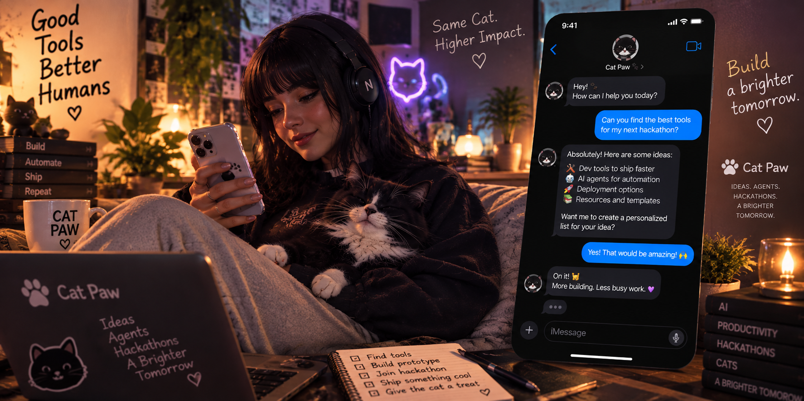
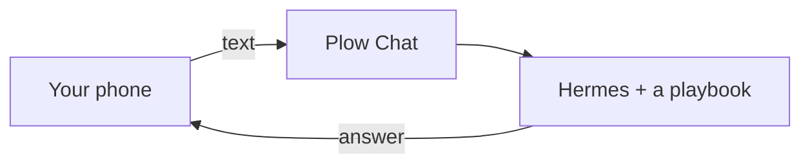
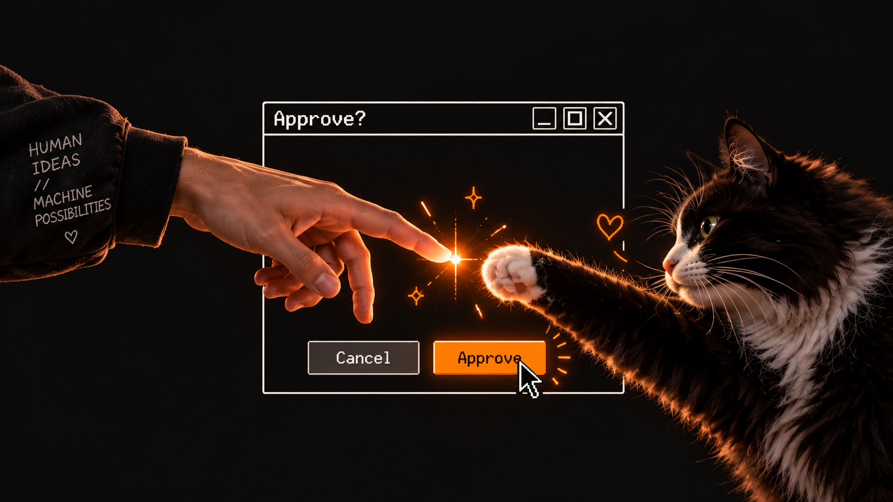

<p align="center">
  <a href="https://aiworthusing.com/agent-index/hermes-cat-paw">
    
  </a>
</p>

<p align="center">
  
</p>

<h1 align="center">Cat Paw 🐾</h1>

<p align="center">
  <strong>Build. Ship. Repeat.</strong>
</p>

<p align="center">
  Text the cat. It picks a playbook and does the job.
</p>

<p align="center">
  <a href="https://aiworthusing.com/agent-index/hermes-cat-paw"></a>
  <a href="LICENSE"></a>
</p>

<p align="center">
  <a href="docs/INSTALL.md">Install</a>
  ·
  <a href="#how-it-works">How it works</a>
  ·
  <a href="#the-line">The line</a>
  ·
  <a href="#text-it-like-this">Text it like this</a>
  ·
  <a href="#what-the-cat-knows">What the cat knows</a>
  ·
  <a href="#a-stop-if-you-want-one">A stop, if you want one</a>
</p>

We build tools for people who build things.

Sometimes the cat breaks production. Usually the cat fixes it too. 🐾

---

## How it works

You text. The cat texts back.

| Piece | What it is |
| --- | --- |
| **Plow Chat** | The phone line. |
| **Hermes** | The brain. It opens one playbook and follows it. |



No desktop app required. The playbooks are the job.

---

## The line

You text from the phone you already have. Plow Chat is that conversation. iMessage in, the cat out.

A line is a named slot on your Plow account: Willow, Aspen, Spruce, Elm, Alder. The installer takes one that's free. The name in the [dashboard](https://app.plow.co/dashboard) is the same number you text.

One message can reach more than one agent. Same chat. A different line.

<p align="center">
  
</p>

---

## Text it like this

Talk like you would at 2am. The cat answers the same way.

```text
You: Spec this before anyone writes code. The signup
     drop-off is the actual bug.

Cat Paw: Opening to-spec. I'll stop at the spec.
         Implementation waits until you say build.

You: Draft the cold email for the three design partners.
     Don't send it.

Cat Paw: prospecting, then cold-email. Draft only.
         Nothing leaves until you say so.

You: The renewal for Northwind looks bad. What do I
     actually know?

Cat Paw: health-read, then renewal-risk. I'll label
         what I read and what I haven't.

You: Review PR 12. Don't run the fork.

Cat Paw: change-review. Read-only until you say the
         tests may run untrusted code.
```

A normal turn:

1. Say the job.
2. The cat opens **one** playbook. It does not invent the procedure.
3. You get the result in the thread.

---

## What the cat knows

Hermes does not freelance a process. It opens a playbook and works that objective.

The playbooks are cloned at install. They are not baked into the image. Each pack keeps its own license. `skills/skill-packs/SKILL.md` is the map the agent actually reads.

| Pack | When you text about… | License |
| --- | --- | --- |
| [Engineering](https://github.com/mattpocock/skills) | Specs, bugs, TDD, review, CI, QA | MIT |
| [Product](https://github.com/phuryn/pm-skills) | Discovery, a PRD, a roadmap | MIT |
| [Marketing](https://github.com/coreyhaines31/marketingskills) | Copy, SEO, launch, ads, social, community, content | MIT |
| Sales | A cold email, a prospect list, a POC | MIT |
| [Customer success](https://github.com/CSPulse/customer-success-skills) | Health, renewal, a QBR, churn | MIT |
| Finance | Runway, metrics, a CFO read. Not a trading desk | MIT |
| [Design](https://github.com/emilkowalski/skills) | Motion, UI, accessibility | MIT |
| Documents | A PDF, docx, pptx, or xlsx you can open | MIT |
| [Academic research](https://github.com/Imbad0202/academic-research-skills) | A paper, a citation check | CC BY-NC 4.0. Not MIT |
| Security | Authorized recon, a hunt, a report. One pack among the others | Apache-2.0 |

Care with the security pack. Probe a target you own, or one you have in writing. Without that, no probe.

Not installed, on purpose:

- `slavingia/skills` has no license.
- Anthropic's `pdf` / `docx` / `pptx` / `xlsx` skills are source-available, not open source.
- RH, recruiting, legal, investor relations, and office-manager playbooks we found cannot be redistributed here.

The image stays small. `gitleaks`, `gh`, `jq`, `yq`, `shellcheck` are in it (`vendor/review-tools.pin`).

<details>
<summary><strong>Load or reload the packs</strong></summary>

```sh
git clone https://github.com/kumanaya/hermes-cat-paw.git
cd hermes-cat-paw
./scripts/install-skills.sh                    # Compose agent
# ./scripts/install-skills.sh --home ~/.hermes  # existing Hermes
```

Windows: `scripts/install-skills.ps1`.

</details>

---

## A stop, if you want one

The cat ships without a desktop app. If you want a pause before an action hits your machine, that project is [Cat Paw Latch](https://github.com/kumanaya/cat-paw-latch). You see the command. You tap yes or no.

<p align="center">
  
</p>

That is optional. The agent works from the text thread either way.

---

## The cat stops

A few things it will not smooth over.

- No playbook for the job → it says so. It does not improvise a procedure.
- A security target without written scope → no probe.

---

## Install

Full guide: **[docs/INSTALL.md](docs/INSTALL.md)**.

| I want | What I get |
| --- | --- |
| [**The agent**](docs/INSTALL.md#agent-only) | Text the cat from my phone. |
| [**I already run Hermes**](docs/INSTALL.md#existing-hermes) | Keep it. Add the cat. |

```sh
git clone https://github.com/kumanaya/hermes-cat-paw.git
cd hermes-cat-paw
# docs/INSTALL.md — pick a path
```

Push button. Ship software. Acquire treats. 🐾

---

<p align="center">
  <strong>Cat Paw 🐾 — Build. Ship. Repeat.</strong>
</p>

<p align="center">
  MIT · <a href="LICENSE">LICENSE</a>
  · playbooks keep the license they shipped with
</p>
